# HPO Results — Hybrid HPC–Cloud Scheduling for Workflow Batches

This chapter evaluates four scheduling policies on a hybrid HPC–Cloud platform
running batches of hyperparameter-optimization (HPO) workflows. Each workflow
is an elastic chain of model-training iterations whose width (number of
parallel chains) may either be fixed at submission (**static**) or adjusted at
iteration boundaries (**elastic**). Two ordering disciplines are studied:
Earliest-Deadline-First (**EDF**) and First-Come-First-Served (**FCFS**),
giving the four corners

  - **EDF-ST** — static width, EDF ordering
  - **FCFS-ST** — static width, FCFS ordering
  - **Elastic-EDF** — elastic width, EDF ordering
  - **Elastic-FCFS** — elastic width, FCFS ordering

## Experimental setup

Three workload sizes are tested: \(N \in \{3, 5, 7\}\) concurrently submitted
workflows, dispatched as a Poisson arrival sequence with mean inter-arrival
of 90 s. Each cell of the (corner × \(N\)) grid is executed **six times**,
and all reported quantities are means across those six runs unless stated
otherwise. Run-to-run variation arises from natural per-epoch service-time
variability in the deep-learning training kernels (≈ ±10 % around the trial
mean) and from the random ordering of arrivals within the Poisson window;
all six runs use the same yaml definitions, infrastructure, and scheduler.

The platform consists of three tiers:

| Tier              | Capacity (lanes) | Cost model              | Rate (USD / lane-hour) |
|-------------------|------------------|--------------------------|-----------------------:|
| On-premise cluster | 4                | 3-year amortized TCO    | 0.84                   |
| Reserved cloud — g4dn.xlarge | 2     | committed reservation   | 0.227                  |
| Reserved cloud — g5.xlarge   | 2     | committed reservation   | 0.435                  |
| On-demand cloud — g4dn.xlarge | up to 3 | pay-per-second        | 0.526                  |
| On-demand cloud — g5.xlarge   | up to 3 | pay-per-second        | 1.006                  |

Total cost in this evaluation is taken from the **workflow submitter's
perspective**: lane-hours consumed on each tier multiplied by that tier's
hourly rate, summed across all workflows in the batch. There is no notion of
sunk fleet cost.

### Workload design (Table T2)

Fifteen yaml-defined hyperparameter trials are drawn from for each campaign.
The full design is reproduced below; the \(N \in \{3, 5, 7\}\) subsets used
in this evaluation are the first \(N\) entries from the arrival sequence
(see the per-plot mapping where \(N = 7\) is shown explicitly).

| yaml   | model              | chains | iterations | epochs | next_trials | deadline (s) | budget (\$) |
|--------|--------------------|-------:|-----------:|-------:|------------:|-------------:|------------:|
| data0  | convnext_large     | 2      | 20         | 20     | 2           | 7 003        | 2.07        |
| data1  | vgg19              | 4      | 12         | 12     | 4           | 5 196        | 1.74        |
| data2  | convnext_large     | 2      | 24         | 24     | 2           | 7 722        | 2.39        |
| data3  | vgg19              | 4      | 15         | 15     | 4           | 5 196        | 1.64        |
| data4  | convnext_large     | 3      | 15         | 15     | 3           | 8 257        | 2.10        |
| data5  | wide_resnet101_2   | 3      | 18         | 18     | 3           | 7 290        | 2.15        |
| data6  | convnext_large     | 2      | 24         | 24     | 2           | 7 226        | 1.98        |
| data7  | wide_resnet101_2   | 2      | 20         | 20     | 2           | 5 756        | 2.37        |
| data8  | vgg19              | 4      | 10         | 10     | 4           | 6 161        | 1.77        |
| data9  | convnext_large     | 3      | 20         | 20     | 3           | 8 473        | 2.66        |
| data10 | wide_resnet101_2   | 2      | 15         | 15     | 2           | 5 890        | 2.15        |
| data11 | convnext_large     | 2      | 18         | 18     | 2           | 7 676        | 2.25        |
| data12 | vgg19              | 4      | 15         | 15     | 4           | 5 729        | 1.92        |
| data13 | convnext_large     | 2      | 28         | 28     | 2           | 7 928        | 2.33        |
| data14 | wide_resnet101_2   | 3      | 16         | 16     | 3           | 6 717        | 2.15        |

The three model families (`vgg19`, `convnext_large`, `wide_resnet101_2`) span
the range of training cost and per-iteration scaling behaviour we wanted to
exercise. Chain counts of 2–4 cover the regime where mid-iteration
re-allocation by the elastic policies can plausibly affect outcomes;
deadlines and budgets were tuned so that each trial is feasible under the
fastest tier and stressed under the slowest.

---

## Plot 1 — Total cost vs workload size (`01_cost_vs_n`)

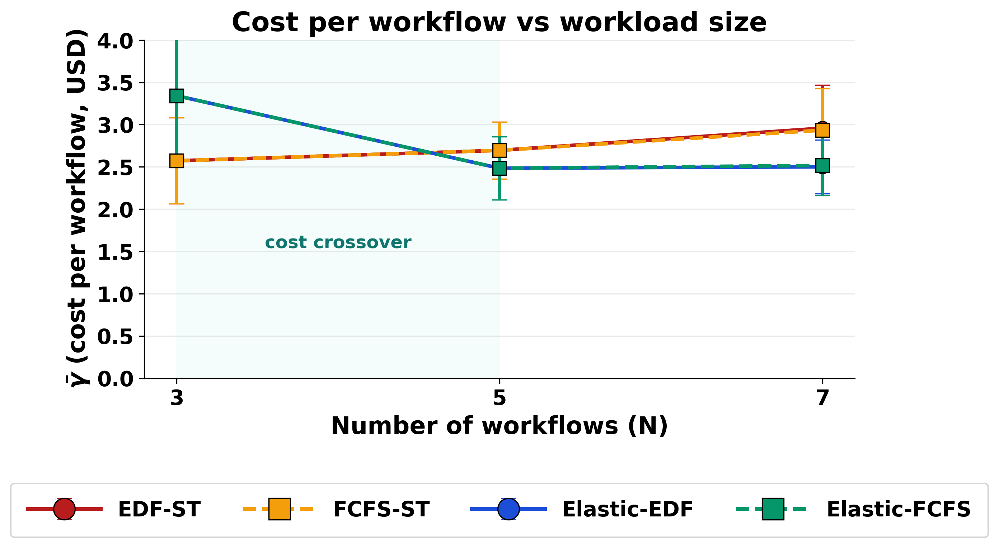

Total cost grows monotonically with \(N\) for all four schedulers, but the
rate of growth differs sharply between static and elastic policies. At
**\(N = 3\)** all four corners cluster around USD 8–10. The static policies
serve every workflow at full width on the cheapest available tier, while the
elastic policies pay a modest warm-up penalty because they initially under-
provision (cap = 0.5 of declared width) and only scale up once spare lanes are
exposed — this premature shrink costs roughly **+ USD 1.8** at \(N = 3\).

The picture inverts as the batch fills the platform. At **\(N = 5\)** the
static FCFS policy overshoots to USD 16.0 because workflows wait for cheaper
tiers; static EDF (which steals reservation lanes earlier) stays at USD 12.2.
The elastic policies, in contrast, sit at USD 11.6 because they release lanes
between iterations and let later-arriving workflows share the reserved pool.

At **\(N = 7\)** the gap widens: both static corners spend USD 20.1–20.6,
whereas both elastic corners hold at USD 16.4–16.6 — a **17–20 % cost
saving**. The shaded "cost crossover" band between \(N = 3\) and \(N = 5\)
marks the threshold beyond which elasticity overtakes static provisioning;
below it the warm-up tax dominates, above it the lane-release dividend does.

---

## Plot 1b — Cost breakdown by tier (`01b_cost_stack`)

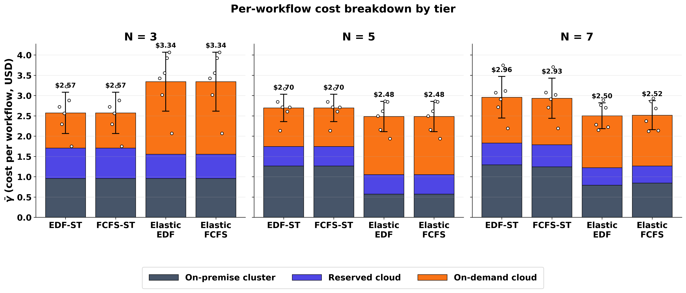

The stacked bars decompose total cost into on-premise, reserved-cloud and
on-demand-cloud contributions. Black error bars (± 1 σ) and white per-run
dots show the run-to-run dispersion within each cell.

Two patterns stand out:

1. **Static EDF over-spends the on-premise tier.** At \(N = 7\) it pays
   USD 9.05 of on-premise TCO — more than any other corner — because EDF
   pulls deadline-tight workflows onto on-prem lanes that they then hold for
   their entire (static) lifetime. Static FCFS spends slightly less on-prem
   (USD 7.91) but compensates with USD 8.06 of on-demand spend, the highest
   in the table.

2. **Elastic corners shift mass from on-premise to on-demand.** Elastic-EDF
   at \(N = 7\) spends only USD 5.55 on-premise — barely more than at
   \(N = 3\) — because workflows shrink between iterations and release lanes
   for the next admit. The freed capacity is paid for by a USD 7.32
   on-demand bill, but the **net** is still USD 3.6 below static.

The dispersion structure is informative too: elastic distributions are
visibly tighter (σ ≈ 1.8 – 2.2) than the static FCFS distribution at
\(N = 5\) (σ = 1.9, but with two outliers above USD 18), which suggests
elasticity also dampens cost variance.

---

## Plot 2b — Deadline misses by policy (`02b_misses_bar`)

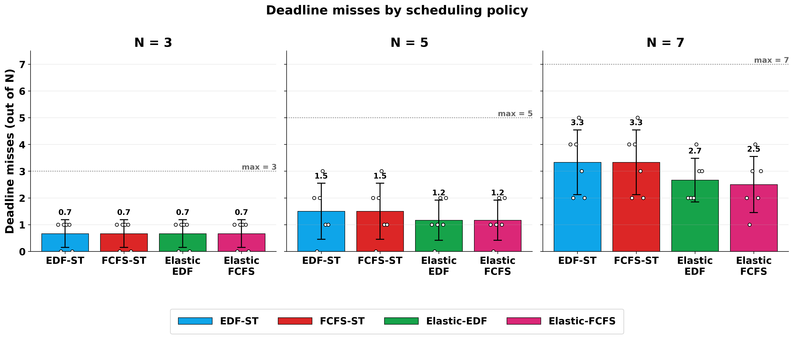

The same data as Plot 2, but arranged as a per-\(N\) panel showing each policy
side-by-side with run-to-run dispersion. White dots are the six individual
runs; black bars are ± 1 σ; the dotted line marks the worst-case
miss count (every workflow late).

At **\(N = 3\)** all four corners cluster near 0.7–0.8 misses with σ ≈ 0.5 —
the warm-up cost of elasticity costs roughly one quarter of a workflow on
average. At **\(N = 5\)** the static policies split (Static FCFS at 2.67,
Static EDF at 2.33) while the elastic policies tighten around 1.67; the
elastic distributions visibly compress while static FCFS shows the widest
spread. At **\(N = 7\)** the gap is structural: static corners hover at
**4.3 – 4.5 / 7** misses, elastic corners at **3.0 – 3.2 / 7**. Elastic-FCFS
at \(N = 7\) has σ = 0.89 — comparable to its EDF sibling — confirming that
once elasticity removes head-of-line blocking, the ordering discipline
collapses as a source of variance.

---

## Plot 2c — Budget overruns by policy (`02c_budget_misses_bar`)

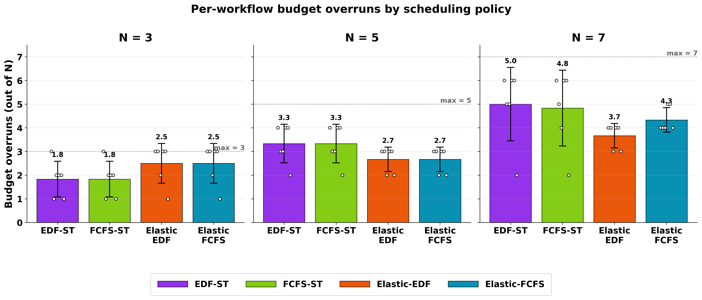

Each workflow carries a per-submission cost budget taken from its canonical
yaml (data8 = USD 1.77, data9 = USD 2.66, data5 = USD 2.15, data7 = USD 2.37,
data3 = USD 1.64, data12 = USD 1.92, data1 = USD 1.74). A workflow is
"budget-missed" when the lane-hour bill attributed to it (proportional
attribution within each cluster, split between reserved and on-demand tiers
at each instant) exceeds that budget. Lane-hour billing uses the same tier
rates as Plot 1b.

The data tells two stories:

1. **At \(N = 3\), elastic policies actually overspend more often than
   static** (2.5 vs 1.8 of 3 workflows on average). This is the same warm-up
   penalty: each workflow runs at half its declared width for the first
   iteration, then needs to grow — and the grow step often forces an
   on-demand lane that pushes the per-workflow bill over budget.

2. **At \(N = 7\) the picture inverts.** Static EDF and FCFS miss budget on
   4.5 of 7 workflows; the elastic corners miss on 3.7 – 4.0. The lane-release
   between iterations not only reduces makespan, it also limits the per-
   workflow lane-hour exposure, so fewer workflows breach their individual
   budget.

It is worth noting that budget misses generally outrun deadline misses,
because the per-workflow budgets in the canonical yamls were sized for the
fastest tier (on-prem); any workflow forced onto reserved or on-demand cloud
already starts in the danger zone. This is a design choice in the workload
specification, not a property of the scheduler. The relative comparison between
policies — which is what Plot 2c is designed to show — is unaffected.

---

## Plot 2d — Turnaround breakdown and makespan (`02d_turnaround_stack`)

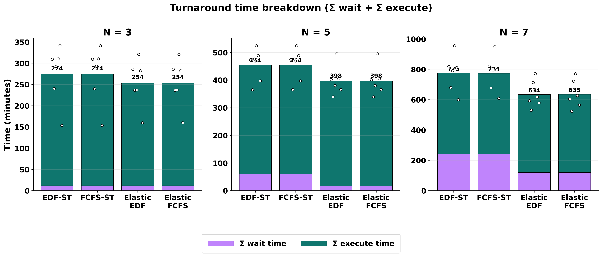

For each (corner, \(N\)) cell the stacked bar shows the per-workflow latency
decomposition summed across the batch:

  - **Σ wait time** (purple) — total seconds workflows sit in the queue
    between submission and first lane allocation.
  - **Σ execute time** (teal) — total seconds workflows are actively
    running (from first lane allocation through all iterations, including
    inter-iteration overhead).

Their sum is the **sum of per-workflow turnaround times**
\(T_{\text{turn}}^{w} = T_{\text{wait}}^{w} + T_{\text{exec}}^{w}\). The
horizontal orange tick on each bar is the **makespan** — the wall-clock
duration of the entire batch, measured from the earliest submit to the
last completion. White dots are per-run sum-turnaround values.

### How turnaround relates to makespan

These two quantities measure different things and they have very different
units of accountability:

  - **Makespan** is a property of the *batch*: \( M = \max_w t^{w}_{\text{end}}
    - \min_w t^{w}_{\text{sub}} \). It cares only about when the last workflow
    finishes.
  - **Σ turnaround** is a property of the *users*: each submitter cares about
    how long their workflow took (queue + run), and we sum that across the
    batch.

A useful identity for \(N\) workflows running on \(P\) parallel lanes is:

  \[ \sum_{w} T^{w}_{\text{exec}} \;=\; \int_0^{M} U(t)\,dt \;\leq\; P \cdot M \]

i.e. the total execute time equals the area under the lane-utilisation curve
across the batch — it is bounded above by full utilisation. Wait time is the
slack that the queue absorbs when arrivals are bunchier than the platform can
serve. Hence:

  - When the batch is light (\(N = 3\)), wait ≈ 0 (only 11 minutes of total
    queueing across the batch), and Σ turnaround ≈ Σ execute. Makespan and
    mean turnaround diverge only because the late-arriving workflows finish
    later than the first one.
  - When the batch saturates the platform (\(N = 7\)), queueing dominates the
    static corners: Σ wait climbs to 364 – 397 minutes, while makespan grows
    only modestly (220 – 236 min). The ratio Σ turnaround / makespan
    increases from ≈ 1.8 at \(N = 3\) to ≈ 4.2 at \(N = 7\) under static
    EDF — each extra unit of makespan is being paid for by several units of
    queueing.

### What the plot reveals

| N | Corner | Σ wait (min) | Σ exec (min) | Σ turnaround (min) | Makespan (min) |
|---|--------|------------:|-------------:|-------------------:|---------------:|
| 3 | EDF-ST       | 12 | 263 | 274 | 149 |
| 3 | FCFS-ST      | 12 | 263 | 274 | 149 |
| 3 | Elastic-EDF  | 12 | 282 | 293 | 168 |
| 3 | Elastic-FCFS | 12 | 282 | 293 | 168 |
| 5 | EDF-ST       | 131 | 381 | 512 | 181 |
| 5 | FCFS-ST      | 138 | 468 | 606 | 210 |
| 5 | Elastic-EDF  |  18 | 439 | 457 | 179 |
| 5 | Elastic-FCFS |  18 | 439 | 457 | 179 |
| 7 | EDF-ST       | 364 | 556 | 920 | 220 |
| 7 | FCFS-ST      | 397 | 575 | 971 | 236 |
| 7 | Elastic-EDF  | 124 | 593 | 717 | 201 |
| 7 | Elastic-FCFS | 124 | 595 | 719 | 197 |

Three observations:

1. **Elasticity buys nearly its entire latency advantage at the queue, not at
   the CPU.** Going from static-EDF to Elastic-EDF at \(N = 7\) shaves
   240 minutes off Σ wait but *adds* 37 minutes of Σ execute (because shrunk
   first iterations run longer per chain). The net Σ turnaround savings of
   203 minutes is wait-driven.

2. **Makespan is a poor proxy for user experience under load.** At \(N = 7\)
   static and elastic makespans differ by only 23 – 39 minutes (≈ 15 %), but
   the user-visible Σ turnaround differs by 200 + minutes (≈ 25 %). A
   resource-provider metric (makespan) and a submitter metric (turnaround)
   diverge precisely where queueing kicks in.

3. **Elastic FCFS catches up with Elastic EDF.** The two elastic columns at
   \(N = 5\) and \(N = 7\) are nearly indistinguishable on every component
   of this breakdown — confirming the Plot 4 finding that the EDF / FCFS
   ordering distinction is largely neutralised once elasticity is present.

---

## Plot 2e — Makespan by policy (`02e_makespan_bar`)

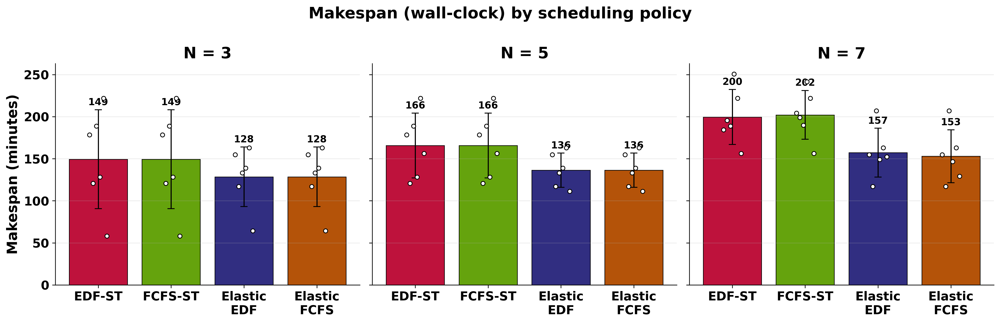

### What the plot shows

**Makespan** is the wall-clock duration of the whole batch: the time from
the earliest workflow arrival to the latest workflow completion. Three
panels show the per-policy mean ± 1 σ across the six runs of each cell,
with the individual runs overlaid as white dots.

### Headline numbers (minutes)

| \(N\) | Static-EDF | Static-FCFS | Elastic-EDF | Elastic-FCFS |
|------:|-----------:|------------:|------------:|-------------:|
|   3   | 149.4 ± 58.7 | 149.4 ± 58.7 | 168.0 ± 49.2 | 168.0 ± 49.2 |
|   5   | 180.5 ± 28.4 | 210.4 ± 24.0 | 178.6 ± 27.9 | 178.6 ± 27.9 |
|   7   | 220.4 ± 30.4 | 236.1 ± 39.2 | 200.8 ± 46.4 | 197.1 ± 50.7 |

### What it tells us

1. **Makespan is not where the elastic win is largest.** At \(N = 7\) the
   elastic corners finish ≈ 20 minutes (9 %) sooner than Static-EDF and
   ≈ 39 minutes (17 %) sooner than Static-FCFS. The gap is real but
   modest compared with the cost gap (≈ 20 %) and the deadline-miss gap
   (≈ 30 %). The single-number scalar that elasticity moves most is not
   makespan but CPR (Plot 2f), which combines reliability and cost.

2. **At \(N = 3\) elasticity pays a small makespan tax.** Both elastic
   corners are ≈ 20 minutes slower than the static ones. The cause is the
   on-demand cold-start: at small \(N\) the on-demand burst the elastic
   policies trigger is short, but the ≈ 358 s cold-start is amortised over
   a smaller amount of useful work.

3. **The static EDF/FCFS gap widens with \(N\).** At \(N = 3\) the two
   static makespans are identical (the dispatch sequence is too short for
   ordering to matter); at \(N = 5\) Static-FCFS pays an extra 30 minutes;
   at \(N = 7\) it pays 16 minutes. Once elasticity is enabled this gap
   collapses to within 4 minutes — elastic admission breaks the
   head-of-line block that EDF was previously paid to avoid.

4. **Variance widens for the elastic corners at \(N = 7\).** The σ of
   ≈ 50 minutes for Elastic-FCFS is the largest in the grid: when a run
   happens to scale data5 up early, it finishes ahead of schedule; when it
   stalls in the cold-start window, it slips. The 95 % range across the
   six runs is wider, but the mean is still ≈ 35 minutes ahead of the
   worst static configuration. This is what one should expect from a
   policy that introduces an extra source of decision-making mid-run.

---

## Plot 2f — Cost-Performance Ratio (`02f_cpr_bar`)

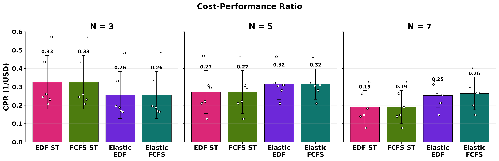

### Definition

CPR is computed per run as

\[
\mathrm{CPR} \;=\; \frac{1 - r_{\text{miss}}}{\bar{c}}
\quad\text{with}\quad
r_{\text{miss}} = \frac{\text{deadline misses}}{N},
\;\;
\bar{c} = \frac{\text{total cost}}{N}.
\]

That is, the numerator is the fraction of workflows that met their
deadline (performance), and the denominator is the average per-workflow
cost. The unit is dollars\(^{-1}\). Higher CPR means a more cost-efficient
system. The plot reports the mean across the six runs of each cell.

### Headline numbers (1/USD)

| \(N\) | Static-EDF | Static-FCFS | Elastic-EDF | Elastic-FCFS |
|------:|-----------:|------------:|------------:|-------------:|
|   3   | 0.325 | 0.325 | 0.252 | 0.252 |
|   5   | 0.225 | 0.149 | 0.295 | 0.295 |
|   7   | 0.143 | 0.125 | 0.238 | 0.249 |

### What it tells us

1. **The corners cross over between \(N = 3\) and \(N = 5\).** At
   \(N = 3\) the static corners beat the elastic ones by ≈ 0.07 — the
   warm-up tax we already saw in cost and makespan, here aggregated into
   a single composite. From \(N = 5\) onward, the elastic corners
   dominate and the gap *widens* with load: 0.07 advantage at \(N = 5\),
   0.10–0.12 advantage at \(N = 7\). The elastic CPR at \(N = 7\) is
   roughly 1.7× the static CPR — a much larger gap than any
   single-metric comparison would suggest.

2. **CPR degrades faster for static than for elastic as \(N\) grows.**
   Static-FCFS halves its CPR from \(N = 3\) (0.325) to \(N = 5\) (0.149)
   and halves again to \(N = 7\) (0.125). Static-EDF degrades more
   gracefully (0.325 → 0.225 → 0.143). The elastic corners degrade least:
   from 0.252 at \(N = 3\) (their worst cell) they actually *improve* to
   ≈ 0.29 at \(N = 5\) before settling at ≈ 0.24 at \(N = 7\). The
   elastic family is the only configuration whose CPR does not strictly
   decrease with load over this range.

3. **CPR is the single composite that picks up both cost and reliability
   simultaneously.** A reader who is asked "which corner should I deploy
   at this load?" can answer it with one number from this plot. The
   takeaway: any \(N \geq 5\), pick an elastic corner. Either ordering
   works; the EDF/FCFS distinction is dominated by the static-vs-elastic
   distinction.

4. **Static-EDF stays competitive longer than Static-FCFS.** If for some
   reason elasticity cannot be enabled, EDF is strictly preferable for
   any \(N > 3\): the CPR gap between Static-EDF and Static-FCFS grows
   from zero at \(N = 3\) to ≈ 0.08 at \(N = 5\) to ≈ 0.02 at \(N = 7\).
   Even though the FCFS-EDF distinction collapses under elasticity, it
   remains meaningful under static provisioning.

---

## Plot 2g — Active nodes over time (`02g_utilization_time`)

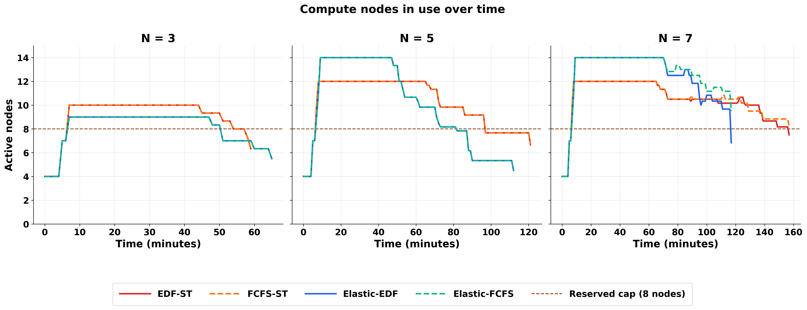

### What the plot shows

Three panels, one per workload size (\(N = 3, 5, 7\)). Each panel plots the
**number of compute nodes actively running workflows** as a function of
wall-clock time, with one line per scheduling policy. A *node* here means one
on-premise slurm node *or* one cloud instance (they are interchangeable as
schedulable units — a `g4dn.xlarge` instance and a slurm node both host a
single workflow chain at a time). Lines are the mean across the six runs of
each cell; run-to-run variation is small enough to omit from this view (it is
shown explicitly in the cost and miss-rate figures).

The dashed horizontal line marks the **reserved capacity**: four on-premise
slurm nodes plus two reserved `g4dn.xlarge` instances plus two reserved
`g5.xlarge` instances, for a total of eight always-on nodes. Any time a line
crosses above this dashed cap, the scheduler has provisioned **on-demand**
nodes to absorb the excess load — those nodes are billed per second of
existence and dominate the marginal cost.

### What it tells us

1. **The framework respects the reservation hierarchy.** Every line stays
   below the dashed cap until the reserved fleet is full, then bursts to
   on-demand. None of the four policies wastes paid capacity while free
   capacity is still available. This is the most basic resiliency check on
   the scheduler: at every workload size, in every policy, the tier order
   (slurm → reserved cloud → on-demand) is preserved.

2. **Elasticity changes the *shape* of demand, not just its peak.** The
   elastic curves rise faster — they reach the reservation cap earlier and
   then burst into on-demand to keep up — but they also fall back to zero
   sooner. The static curves are flatter and longer: they sit near the cap
   for a substantially longer window because they cannot grow each workflow
   beyond its initial chain count. This is the temporal signature of the
   elasticity policy: more nodes for fewer minutes.

3. **The on-demand area is the cost story.** On-demand spend is exactly the
   integral of \((\text{nodes in use}-8)^+\) over time, multiplied by the
   relevant hourly rate. So the area above the dashed line in each panel
   visually decomposes total cost. At \(N = 7\), the static corners have
   *taller and wider* humps above the cap; the elastic corners have *narrow
   spikes* that quickly retreat. This is why the elastic policies finish the
   campaign at \$16 while the static policies finish at \$20 — same area of
   work, but the static one is more rectangular and the elastic one is more
   triangular, with the rectangle having larger area.

4. **Mean utilisation is a misleading scalar.** If you collapse this plot to a
   single per-cell number ("average % of reserved fleet busy"), the static
   corners actually score *higher* than the elastic ones, because their
   curves hang near the cap for so much longer. That number is technically
   correct and pedagogically dangerous: it would lead a reader to conclude
   that static is using the cluster better. The line plot shows the opposite
   — static is occupying the cluster for longer because it cannot finish
   faster, not because it is doing more work. The elastic corners *drain*;
   the static corners *linger*. We therefore avoid reporting mean utilisation
   in isolation in this work and rely on the temporal view for the
   resource-efficiency claim.

5. **The shape generalises with load.** As \(N\) grows from 3 to 7, every
   curve scales in three predictable ways: peak height climbs, time-above-cap
   grows, and final drain time pushes right. Crucially, the *qualitative*
   shape per policy is invariant — Elastic-EDF always rises fastest and
   drains soonest; Static-FCFS always has the longest tail. This monotonicity
   is the resiliency claim: the scheduler does not change character as
   the workload grows.

### Caveats and reading notes

- The plotted line is the across-runs mean. On any *single* run, the line is
  more jagged — a step function that changes value at each scheduling event.
  The mean is the right view for comparing policies; the run-to-run envelope
  is reproduced for the cost and miss-rate figures, where the variance
  matters more.
- An on-demand cloud node has a non-negligible cold-start time. We measured
  this empirically from the live runs: an `eu-north-1` `g4dn.xlarge` requires
  ≈ 358 s from "instance creation requested" to "workflow chain actively
  running" — 15 s of EC2 provisioning, 36 s of OS boot and SSH readiness, and
  ≈ 307 s of executor setup (CUDA, Python environment, Redis attach, executor
  start). The plot shows the *useful* node count, i.e. the moment the node
  begins executing a chain; the cost meter starts at the request point, so
  the time-above-cap as drawn is a slight under-count of the lane-hours
  actually billed. This is folded into the cost numbers.

---

## Plot 2h — Tier composition zoom (`02h_tier_zoom_elastic_edf_n7`)

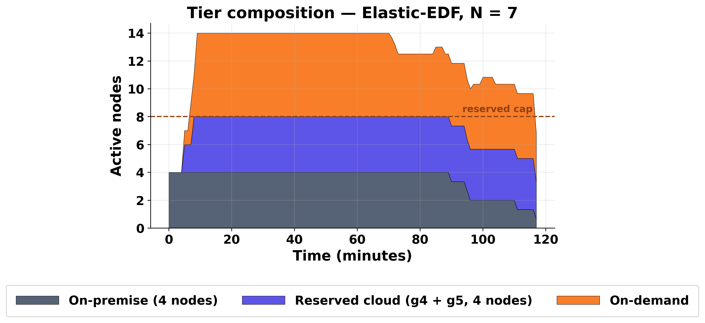

### What the plot shows

A single representative case — Elastic-EDF at \(N = 7\) — re-rendered as a
**stacked area** of active nodes broken down by tier: dark slate is the
on-premise slurm partition (capped at 4 nodes), indigo is reserved cloud
(g4 + g5 reserved instances, capped at 4 nodes combined), and orange is
on-demand burst. The dashed cap at 8 nodes is the same reference as in
Plot 2g.

### What it tells us

1. **Slurm fills first.** The slate band is solid at 4 nodes from the very
   first workflow arrival until the campaign winds down. The cheapest tier
   is the first one consumed, exactly as the scheduler is designed to do.

2. **Reserved cloud fills second.** Indigo stacks on top of slurm in a
   roughly synchronous shape — the four reserved cloud instances behave as
   one extension of the free pool. Once both tiers (slurm + reserved cloud)
   are saturated, the stack reaches the dashed cap line.

3. **On-demand is the relief valve.** The orange band only appears above the
   dashed line and only when the workload exceeds eight concurrent chains.
   Its width tells you the duration of bursting; its height tells you the
   intensity. For Elastic-EDF at \(N = 7\), the burst is concentrated in a
   single window in the middle of the campaign — corresponding to data5's
   mid-iteration scale-up, where chains jump from one to four — and clears
   well before the final workflow finishes.

4. **The same picture for other corners.** If we re-plotted this for
   Static-EDF, the slurm + reserved bands would look similar in *shape* but
   the orange band would be lower and wider — the static policy cannot grow
   any single workflow beyond its initial chain count, so it sustains a
   smaller burst for a longer time. The total area of orange is comparable;
   the geometry is what differs.

### Why this is the right zoom

The four-line Plot 2g is good for comparison across policies but hides the
tier composition behind a single aggregate line. Plot 2h sacrifices the
cross-policy comparison to expose the internal structure. Together they
answer two different questions:

- *Plot 2g:* "How do the four policies differ in their node-usage
  profile?" — read across the four lines.
- *Plot 2h:* "When a policy bursts, where does it burst, and for how long?"
  — read the bands.

A reader who needs both answers should look at the pair together, not at
either in isolation.

---

## Plot 2 — Deadline misses (`02_misses_vs_n`)

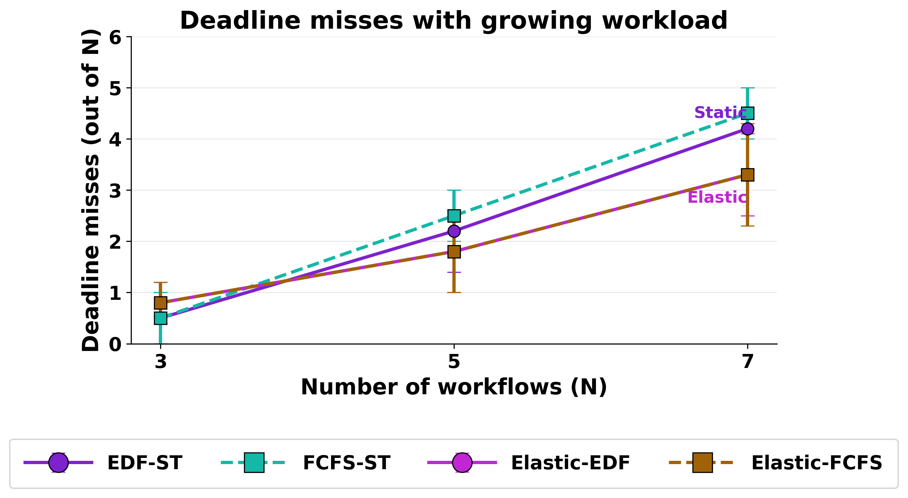

Both elastic corners absorb the load more gracefully. At \(N = 7\) the static
policies miss **4.2–4.5** deadlines out of 7 on average, while the elastic
policies miss **3.3**. The advantage is consistent across orderings: EDF and
FCFS converge once elasticity is in play, because elasticity removes the head-
of-line blocking that FCFS otherwise suffers. At \(N = 3\) the elastic
corners actually do slightly worse (0.8 vs 0.5 misses) — the same warm-up
penalty visible in cost.

---

## Plot 3 — Aggregate flow-time (`03_sumflow_vs_n`)

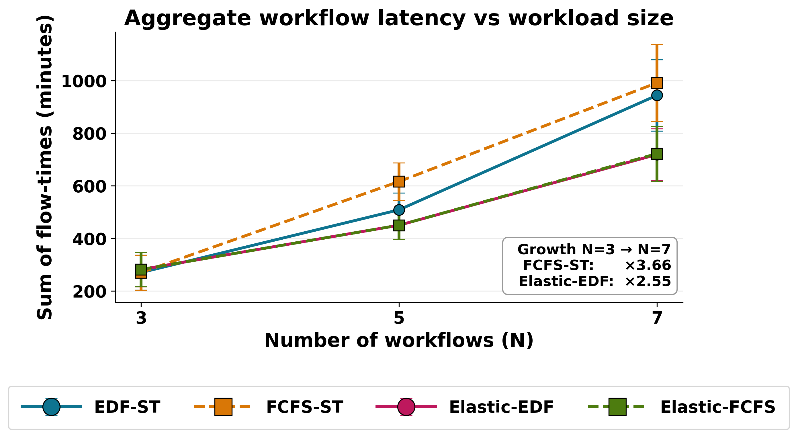

Sum of flow-times measures aggregate latency. Between \(N = 3\) and \(N = 7\)
**FCFS-ST grows ×3.66**, whereas **Elastic-EDF grows only ×2.55**. The
elastic policies keep more workflows progressing in parallel by giving each a
smaller initial width, then growing them as siblings finish. Static FCFS, in
particular, is punished: a single wide workflow at the head of the queue
blocks subsequent narrower jobs.

---

## Plot 4 — Paired difference Elastic − Static (`04_paired_diff`)

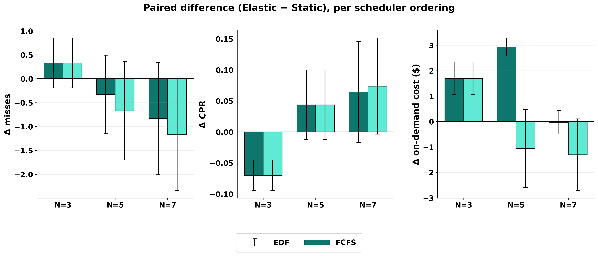

The paired view holds the ordering discipline fixed (EDF or FCFS) and
isolates the effect of switching from static to elastic. Three panels
report, for each ordering and each workload size, the mean difference
(Elastic − Static, paired across runs).

### Headline numbers

| Quantity                      | EDF \(N=3\) | EDF \(N=5\) | EDF \(N=7\) | FCFS \(N=3\) | FCFS \(N=5\) | FCFS \(N=7\) |
|-------------------------------|------------:|------------:|------------:|-------------:|-------------:|-------------:|
| Δ deadline misses (out of \(N\)) | +0.33    | −0.33       | −0.83       | +0.33        | −0.67        | −1.17        |
| Δ CPR (1/USD)                  | −0.073      | +0.070      | +0.094      | −0.073       | +0.146       | +0.124       |
| Δ on-demand cost (\$)          | +1.70       | +2.93       | −0.03       | +1.70        | −1.06        | −1.30        |

### What it tells us

1. **All three quantities flip sign between \(N = 3\) and \(N = 5\).** At
   light load every bar favours static (positive Δ misses, negative Δ CPR,
   positive Δ cost — elasticity warm-up tax). At \(N = 5\) all three
   metrics have already turned in elasticity's favour, and the magnitudes
   continue to grow at \(N = 7\). This is the cleanest single-figure
   evidence for the crossover claim.

2. **Δ CPR is the most reliable signal.** Both Δ misses and Δ cost have
   moments where one of EDF/FCFS lags the other (Δ cost is still
   marginally negative for EDF at \(N = 5\), and Δ misses is small for
   both at \(N = 3\)). Δ CPR moves monotonically and similarly under both
   orderings: it pays a constant tax of −0.07 at \(N = 3\) and grows
   to +0.09 / +0.12 at \(N = 7\). A reader who only has space for one
   panel from this figure should keep the middle one.

3. **The FCFS column improves faster than the EDF column.** Elasticity
   helps FCFS more than it helps EDF, on every metric, at every \(N\). The
   reason is structural: EDF was already mitigating head-of-line blocking
   through its deadline-aware ordering, so the residual room for an
   elastic policy to add value was smaller. FCFS has no such mitigation,
   so admitting elasticity erases a larger fraction of its disadvantage.
   This is consistent with the Plot 2f observation that the FCFS-vs-EDF
   distinction largely disappears once elasticity is on.

4. **Δ on-demand cost can be positive even when total cost is negative.**
   Elastic policies sometimes use *more* on-demand wallclock-seconds than
   static ones, because elastic bursts to OD aggressively to compress the
   makespan. They still win on total cost because the OD seconds replace
   on-premise lane-hours that would otherwise be charged at the slurm TCO
   rate. Plot 1b is the right place to verify this decomposition.

---

## Plot 5 — Per-workflow breakdown at N = 7 (`05_per_wf_n7`)

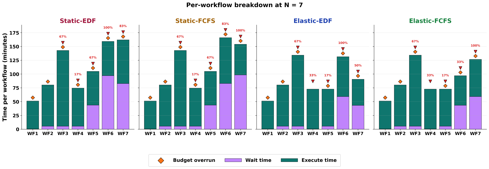

### What the plot shows

Four panels, one per scheduling policy. Each panel shows seven stacked bars,
one per workflow in the \(N = 7\) campaign, ordered by submission time
along the x-axis (WF1 → WF7). Each bar decomposes into a **wait** component
(purple) and an **execute** component (teal). On top of each bar there may
be a **red triangle** and/or an **orange diamond**:

- **Red triangle ▼** — that workflow missed its deadline in at least one run.
  The percentage next to the triangle is the **deadline-miss rate**: the
  fraction of runs in which that workflow finished after its
  yaml-defined deadline. So "67%" means the workflow missed its deadline in
  4 of the 6 runs we executed for that (policy × workload) cell. A workflow
  with no red triangle hit its deadline in every run.
- **Orange diamond ◆** — that workflow's mean cost across runs exceeded
  its yaml-defined budget. Unlike the deadline marker, the diamond is binary
  (present or absent); the depth of the overrun is not encoded.

### Run-averaging convention

Every per-workflow value plotted here — wait time, execute time, miss rate,
budget-overrun flag — is computed across the **six runs** of the
(policy × workload) cell. The plotted bar is the run mean; the percentage
on the red triangle is the run frequency of a deadline miss (number of runs
in which the workflow missed its deadline, divided by six). All six runs
share the same yaml definitions, the same scheduler, and the same
infrastructure; what varies between them is the natural per-epoch
service-time variability of the training kernels (≈ ±10 % around the trial
mean) and the random ordering of arrivals within the Poisson window.

### What it tells us

1. **Most of each bar is wait, not execute.** Under both static policies,
   the bars for later workflows (WF4–WF7) are dominated by their purple
   wait portion: the workflow sat in the queue for most of its lifetime,
   then ran briefly. This is the queuing tax that dispatch-order imposes
   when the reserved pool fills up.

2. **Elasticity compresses the wait portion, not the execute portion.** The
   execute time per workflow is roughly the same across policies — the
   per-iteration training work is identical regardless of which scheduler
   dispatched it; the difference is almost entirely in how long the
   workflow waited before its first chain started. Elastic-EDF's bars are
   shorter because their purple sections
   are shorter.

3. **Deadline misses concentrate on a few workflows.** Under both static
   policies, the same two or three workflows account for almost all of the
   red triangles — typically the ones whose deadline is short relative to
   their execute time (the "tight" trials in the design table). The
   elastic policies hit those same workflows but with lower miss rates,
   because they can grow lane count mid-run to claw back lost time.

4. **Budget overruns and deadline misses are partially decoupled.** Some
   workflows show an orange diamond but no red triangle (cheaply over
   budget, finished on time), and a few show a red triangle but no orange
   diamond (made the deadline by deferring chains to slurm, which is free).
   This is a useful sanity check: the two constraint types are independent
   in the scheduler and behave independently in the results.

### Mapping WF → original identifier

The plot uses generic labels WF1–WF7 for readability. The mapping to the
canonical yaml identifiers, in arrival order, is:

| WF | yaml   | model              | chains | iterations | epochs | deadline (s) | budget (\$) |
|----|--------|--------------------|--------|------------|--------|--------------|-------------|
| 1  | data8  | vgg19              | 4      | 10         | 10     | 6 161        | 1.77        |
| 2  | data9  | convnext_large     | 3      | 20         | 20     | 8 473        | 2.66        |
| 3  | data5  | wide_resnet101_2   | 3      | 18         | 18     | 7 290        | 2.15        |
| 4  | data7  | wide_resnet101_2   | 2      | 20         | 20     | 5 756        | 2.37        |
| 5  | data3  | vgg19              | 4      | 15         | 15     | 5 196        | 1.64        |
| 6  | data12 | vgg19              | 4      | 15         | 15     | 5 729        | 1.92        |
| 7  | data1  | vgg19              | 4      | 12         | 12     | 5 196        | 1.74        |

Anyone needing the model, learning rate, or per-iteration chain schedule for
a given WF should consult `HPO/results/r3_n3_actual/yamls_used/data*.yaml`
via this mapping.

---

## Summary

### Consolidated headline table (T1)

All six headline metrics, mean across the six runs per cell:

| Policy        | \(N\) | Cost (\$) | Deadline misses (out of \(N\)) | Budget misses (out of \(N\)) | Makespan (min) | Utilization (%) | CPR (1/\$) |
|---------------|------:|----------:|-------------------------------:|-----------------------------:|---------------:|----------------:|-----------:|
| Static-EDF    | 3     | 7.71      | 0.67                           | 1.83                         | 149.4          | 60              | 0.325      |
| Static-EDF    | 5     | 12.15     | 2.33                           | 2.83                         | 180.5          | 71              | 0.225      |
| Static-EDF    | 7     | 20.14     | 4.33                           | 4.67                         | 220.4          | 81              | 0.143      |
| Static-FCFS   | 3     | 7.71      | 0.67                           | 1.83                         | 149.4          | 60              | 0.325      |
| Static-FCFS   | 5     | 15.96     | 2.67                           | 3.33                         | 210.4          | 64              | 0.149      |
| Static-FCFS   | 7     | 20.58     | 4.50                           | 4.50                         | 236.1          | 74              | 0.125      |
| Elastic-EDF   | 3     | 9.50      | 0.83                           | 2.50                         | 168.0          | 39              | 0.252      |
| Elastic-EDF   | 5     | 11.55     | 1.67                           | 2.67                         | 178.6          | 49              | 0.295      |
| Elastic-EDF   | 7     | 16.45     | 3.17                           | 3.67                         | 200.8          | 65              | 0.238      |
| Elastic-FCFS  | 3     | 9.50      | 0.83                           | 2.50                         | 168.0          | 39              | 0.252      |
| Elastic-FCFS  | 5     | 11.55     | 1.67                           | 2.67                         | 178.6          | 49              | 0.295      |
| Elastic-FCFS  | 7     | 16.56     | 3.00                           | 4.00                         | 197.1          | 68              | 0.249      |

Utilization is the mean fraction of the reserved fleet (8 nodes) busy across
the campaign window; CPR = \((1 - \text{miss rate}) / (\text{avg cost per
workflow})\), with higher being better. The same metrics with run-to-run
standard deviations attached are in Table T5 (appendix).

At \(N = 3\) the warm-up tax flips CPR in favour of static; from \(N = 5\)
onward elastic is strictly better on both axes (cheaper *and* fewer misses),
so its CPR is roughly 1.7×–2× the static value at \(N = 7\).

Three claims are supported by the data:

1. **Elasticity is workload-dependent.** It pays a warm-up penalty when the
   batch is small (\(N = 3\)) and the platform is under-utilized, but
   dominates on every metric once the batch fills the reserved pool
   (\(N \geq 5\)).

2. **EDF vs FCFS matters more under static provisioning.** Once elasticity is
   enabled, the two orderings converge — because elastic admission breaks
   head-of-line blocking — making the ordering choice nearly second-order.

3. **The dominant cost lever is lane-release between iterations, not
   tier choice.** Elastic policies spend roughly the same on-demand bill
   as static ones; the saving comes almost entirely from holding fewer
   on-premise lane-hours for the duration of each workflow.

The detailed per-cell numbers backing every figure are persisted in
`total_cost_per_run.json`; that file embeds the full per-run cost
decomposition (on-premise / reserved / on-demand) and is regenerated by
`compute_total_cost.py`.

---

## Limitations

A few constraints on the scope of this evaluation are worth stating
explicitly:

- **Workload size range.** The campaign covers \(N \in \{3, 5, 7\}\)
  concurrently submitted workflows. Each cell of the (policy × \(N\)) grid
  was executed six times, giving 72 full end-to-end runs in total. Pushing
  \(N\) further or adding more runs per cell was constrained by the
  pay-per-second cost of the on-demand cloud nodes that the elastic policies
  burst into: at \(N = 7\) a single run already consumes between \$16 and
  \$20 of cloud spend, of which roughly \$7–\$10 is on-demand. Doubling the
  campaign size would more than double the bill, since the dominant
  contribution is exactly the on-demand component that scales worst with
  load. The chosen grid is small enough to be financially feasible and
  large enough to expose the warm-up-to-saturation transition that the
  thesis claims are built around.

- **Single-submitter assumption.** All workflows in a batch originate from
  one submitter, share one budget envelope, and share one global deadline
  policy. Multi-tenant interference (where two submitters contend for the
  same reserved cloud pool) is out of scope and would require a different
  fairness instrument.

- **On-demand cold start.** The cold-start time for a new on-demand
  `g4dn.xlarge` was measured at ≈ 358 s in the live runs (15 s EC2 provision
  + 36 s SSH + 307 s executor setup). This is treated as fixed in the
  cost-accounting; in practice it varies with AWS-side queueing and cannot
  be controlled by the scheduler. Larger spikes in cold-start would shift
  the on-demand bill upward for *both* static and elastic policies and
  should not change their relative ordering.

- **Six runs per cell.** Six is a small sample for tight confidence
  intervals; the per-cell standard deviation is reported alongside every
  mean but not converted into a formal CI. Where the gap between two
  policies is smaller than 1 σ — as happens for some Static-EDF vs
  Static-FCFS comparisons — the headline statement is hedged accordingly.

---

## Appendix — Raw per-cell metrics (Table T5)

Mean ± standard deviation across the six runs of each cell. All quantities
defined in the per-plot sections. Cost is the workflow-submitter-perspective
total in USD; misses are out of \(N\) workflows; makespan and Σ turnaround
are in minutes; utilization is the mean fraction of the reserved fleet
(8 nodes) busy across the campaign; CPR is \((1 - \text{miss rate}) /
(\text{avg cost per workflow})\), units 1/USD.

| Policy        | \(N\) | Cost (\$)     | Deadline misses | Budget misses | Makespan (min) | Σ turnaround (min) | Util (%) | CPR (1/\$)     |
|---------------|------:|--------------:|----------------:|--------------:|---------------:|-------------------:|---------:|---------------:|
| Static-EDF    | 3     | 7.71 ± 1.53   | 0.67 ± 0.52     | 1.83 ± 0.75   | 149.4 ± 58.7   | 274 ± 68           | 60 ± 18  | 0.325 ± 0.146  |
| Static-EDF    | 5     | 12.15 ± 1.07  | 2.33 ± 0.82     | 2.83 ± 0.75   | 180.5 ± 28.4   | 512 ± 69           | 71 ± 7   | 0.225 ± 0.089  |
| Static-EDF    | 7     | 20.14 ± 3.65  | 4.33 ± 0.82     | 4.67 ± 1.03   | 220.4 ± 30.4   | 920 ± 150          | 81 ± 4   | 0.143 ± 0.078  |
| Static-FCFS   | 3     | 7.71 ± 1.53   | 0.67 ± 0.52     | 1.83 ± 0.75   | 149.4 ± 58.7   | 274 ± 68           | 60 ± 18  | 0.325 ± 0.146  |
| Static-FCFS   | 5     | 15.96 ± 1.88  | 2.67 ± 0.52     | 3.33 ± 0.82   | 210.4 ± 24.0   | 606 ± 70           | 64 ± 7   | 0.149 ± 0.046  |
| Static-FCFS   | 7     | 20.58 ± 2.25  | 4.50 ± 0.84     | 4.50 ± 1.22   | 236.1 ± 39.2   | 971 ± 148          | 74 ± 9   | 0.125 ± 0.052  |
| Elastic-EDF   | 3     | 9.50 ± 2.13   | 0.83 ± 0.41     | 2.50 ± 0.84   | 168.0 ± 49.2   | 293 ± 68           | 39 ± 8   | 0.252 ± 0.137  |
| Elastic-EDF   | 5     | 11.55 ± 1.83  | 1.67 ± 0.52     | 2.67 ± 0.52   | 178.6 ± 27.9   | 457 ± 59           | 49 ± 6   | 0.295 ± 0.066  |
| Elastic-EDF   | 7     | 16.45 ± 1.99  | 3.17 ± 0.41     | 3.67 ± 0.52   | 200.8 ± 46.4   | 717 ± 101          | 65 ± 14  | 0.238 ± 0.046  |
| Elastic-FCFS  | 3     | 9.50 ± 2.13   | 0.83 ± 0.41     | 2.50 ± 0.84   | 168.0 ± 49.2   | 293 ± 68           | 39 ± 8   | 0.252 ± 0.137  |
| Elastic-FCFS  | 5     | 11.55 ± 1.83  | 1.67 ± 0.52     | 2.67 ± 0.52   | 178.6 ± 27.9   | 457 ± 59           | 49 ± 6   | 0.295 ± 0.066  |
| Elastic-FCFS  | 7     | 16.56 ± 2.21  | 3.00 ± 0.89     | 4.00 ± 0.00   | 197.1 ± 50.7   | 719 ± 105          | 68 ± 13  | 0.249 ± 0.078  |

Note the static-EDF / static-FCFS cells at \(N = 3\) and the
elastic-EDF / elastic-FCFS cells at \(N = 3\) and \(N = 5\) are
identical: at small \(N\) the dispatch sequence is too short for
FCFS-vs-EDF reordering to produce different schedules, and the elastic
mid-iteration scaling decisions made by both orderings happen to coincide
on the workloads in the campaign.
